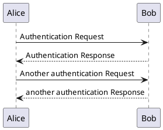

# cautious-octo-spoon

<?xml version="1.0" encoding="UTF-8" standalone="no"?><svg xmlns="http://www.w3.org/2000/svg" xmlns:xlink="http://www.w3.org/1999/xlink" contentScriptType="application/ecmascript" contentStyleType="text/css" height="157px" preserveAspectRatio="none" style="width:120px;height:157px;" version="1.1" viewBox="0 0 120 157" width="120px" zoomAndPan="magnify"><defs><filter height="300%" id="f1hbxqy1skkzh4" width="300%" x="-1" y="-1"><feGaussianBlur result="blurOut" stdDeviation="2.0"/><feColorMatrix in="blurOut" result="blurOut2" type="matrix" values="0 0 0 0 0 0 0 0 0 0 0 0 0 0 0 0 0 0 .4 0"/><feOffset dx="4.0" dy="4.0" in="blurOut2" result="blurOut3"/><feBlend in="SourceGraphic" in2="blurOut3" mode="normal"/></filter></defs><g><line style="stroke: #A80036; stroke-width: 1.0; stroke-dasharray: 5.0,5.0;" x1="33" x2="33" y1="38.4883" y2="117.1094"/><line style="stroke: #A80036; stroke-width: 1.0; stroke-dasharray: 5.0,5.0;" x1="91" x2="91" y1="38.4883" y2="117.1094"/><rect fill="#FEFECE" filter="url(#f1hbxqy1skkzh4)" height="30.4883" style="stroke: #A80036; stroke-width: 1.5;" width="47" x="8" y="3"/><text fill="#000000" font-family="sans-serif" font-size="14" lengthAdjust="spacingAndGlyphs" textLength="33" x="15" y="23.5352">Alice</text><rect fill="#FEFECE" filter="url(#f1hbxqy1skkzh4)" height="30.4883" style="stroke: #A80036; stroke-width: 1.5;" width="47" x="8" y="116.1094"/><text fill="#000000" font-family="sans-serif" font-size="14" lengthAdjust="spacingAndGlyphs" textLength="33" x="15" y="136.6445">Alice</text><rect fill="#FEFECE" filter="url(#f1hbxqy1skkzh4)" height="30.4883" style="stroke: #A80036; stroke-width: 1.5;" width="40" x="69" y="3"/><text fill="#000000" font-family="sans-serif" font-size="14" lengthAdjust="spacingAndGlyphs" textLength="26" x="76" y="23.5352">Bob</text><rect fill="#FEFECE" filter="url(#f1hbxqy1skkzh4)" height="30.4883" style="stroke: #A80036; stroke-width: 1.5;" width="40" x="69" y="116.1094"/><text fill="#000000" font-family="sans-serif" font-size="14" lengthAdjust="spacingAndGlyphs" textLength="26" x="76" y="136.6445">Bob</text><polygon fill="#A80036" points="79,65.7988,89,69.7988,79,73.7988,83,69.7988" style="stroke: #A80036; stroke-width: 1.0;"/><line style="stroke: #A80036; stroke-width: 1.0;" x1="33.5" x2="85" y1="69.7988" y2="69.7988"/><text fill="#000000" font-family="sans-serif" font-size="13" lengthAdjust="spacingAndGlyphs" textLength="33" x="40.5" y="65.0566">Hello</text><polygon fill="#A80036" points="44.5,95.1094,34.5,99.1094,44.5,103.1094,40.5,99.1094" style="stroke: #A80036; stroke-width: 1.0;"/><line style="stroke: #A80036; stroke-width: 1.0;" x1="38.5" x2="90" y1="99.1094" y2="99.1094"/><text fill="#000000" font-family="sans-serif" font-size="13" lengthAdjust="spacingAndGlyphs" textLength="18" x="50.5" y="94.3672">Hi!</text><!--
@startuml firstDiagram

Alice -> Bob: Hello
Bob -> Alice: Hi!
			
@enduml

PlantUML version 1.2019.06(Fri May 24 20:10:25 EEST 2019)
(GPL source distribution)
Java Runtime: OpenJDK Runtime Environment
JVM: OpenJDK 64-Bit Server VM
Java Version: 1.8.0_152-release-1343-b01
Operating System: Mac OS X
OS Version: 10.14.5
Default Encoding: UTF-8
Language: en
Country: IL
--></g></svg>
